# Lumina

[](LICENSE)

**One lamp lights the room.** Lumina is a family of themes for Emacs,
Neovim, VS Code, WezTerm and the terminal, built on a single idea: in
every flavor, one colour is the light (the cursor, the definition you
are reading, the current line, the heading you are in) and everything
else sits in the room at equal weight, never louder than the lamp.

Nine flavors in two ranges, each in dark, light and high contrast:
38 themes. The flagship is **Prisma**: a white ray is the lamp, the
code is its spectrum.

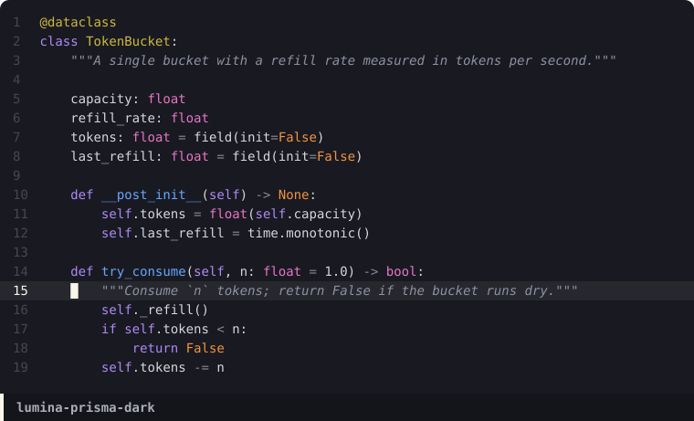 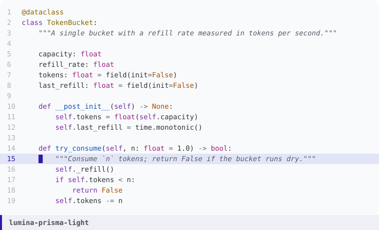

## What makes it different

- **One lamp.** Each flavor has one lead colour, and only the lamp
  glows: cursor, current line number, function definitions, headings,
  mode-line bar, search. Keywords never shout.
- **Equal lightness.** Accents are tuned in OKLCH so that every
  non-lamp accent sits within 0.08 lightness of the others. Vivid or
  muted, nothing jumps out by accident; that is what keeps even the
  vivid range elegant instead of garish.
- **Light that follows you.** The lamp tints the current line, the
  selection and the completion candidate, and flashes on every jump.
  With [auto-dim-other-buffers](https://github.com/mina86/auto-dim-other-buffers.el)
  the windows you are not working in fall into shade.
- **Measured, not guessed.** Text sits at 10.8 to 13.4:1, comments at
  4.4:1 or more, every accent at 4.5:1 or more. `make check` refuses a
  palette that drifts.
- **High contrast built in.** Every theme ships a `-contrast` twin:
  text 15:1 or more, comments 6:1, every accent 7:1 (WCAG AAA), same
  lamp, same hues.
- **Readable diffs.** Added, removed and changed lines sit on tinted
  grounds in magit, diff, smerge and ediff.

## Flavors

### Muted

Quiet rooms for long sessions.

| Flavor | Lamp | Scene |
|---|---|---|
| **Dawn** | amber | warm sepia room lit by a single candle |
| **Oxblood** | rose spotlight | a theatre after the curtain falls; oxblood velvet, plum and gilt |
| **Tide** | bioluminescence | deep ocean at night, lit from within |
| **Canopy** | leaf-filtered sun | pine forest at noon; chlorophyll keywords, russet types |
| **Slate** | steel blue | cold graphite; near-achromatic, one steel voice |

### Vivid

Saturated colour, still at equal lightness and still under one lamp.

| Flavor | Lamp | Scene |
|---|---|---|
| **Nocturne** | sodium streetlamp | a city at night under an indigo sky; neon violet, cobalt, jade |
| **Amethyst** | citrine | inside a split amethyst geode; orchid, mint, ice blue |
| **Obsidian** | molten lava | near-black volcanic glass; glacier teal, cobalt, magenta |
| **Prisma** | white ray; ultraviolet in light | white light through a prism; the code is the full spectrum. Also `lumina-prisma-light-ink`: black and white, one lamp of black ink |

### Gallery

**Oxblood**

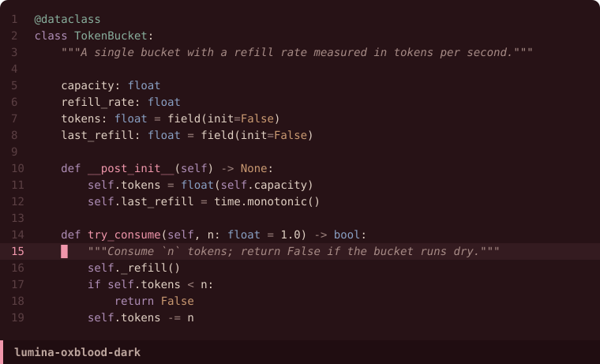 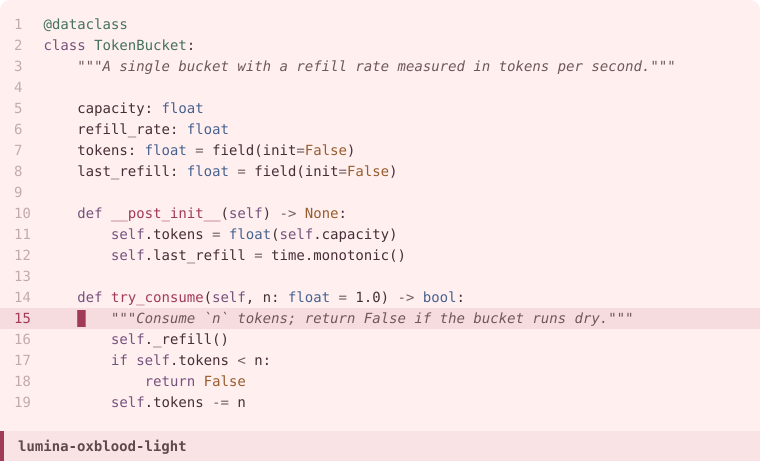

**Tide**

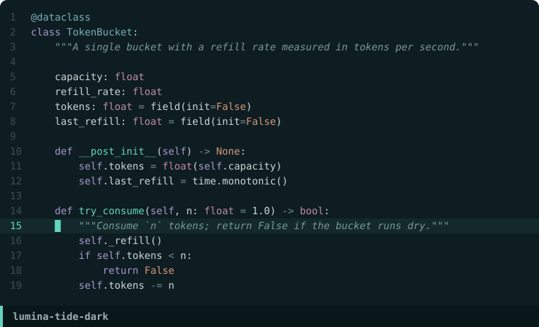 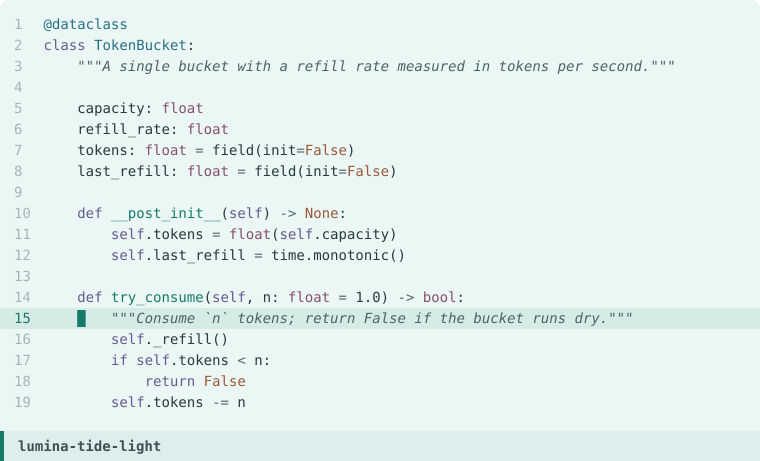

**Canopy**

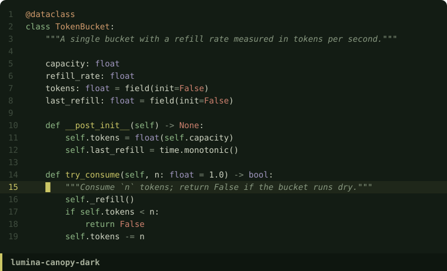 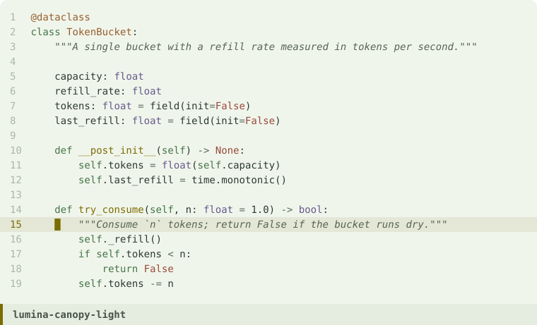

**Slate**

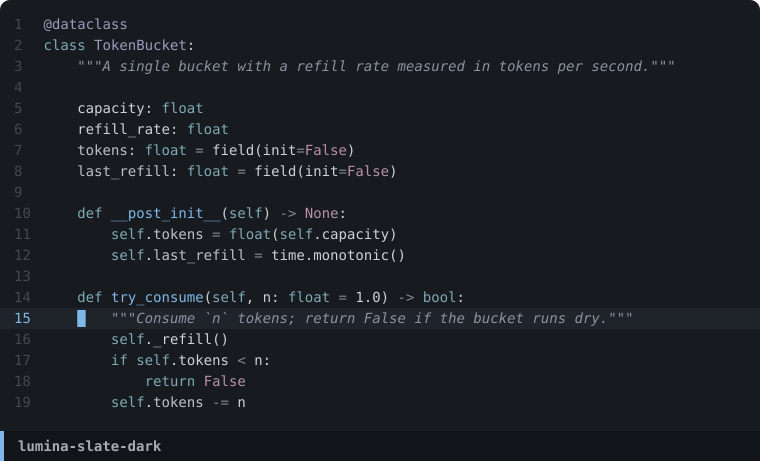 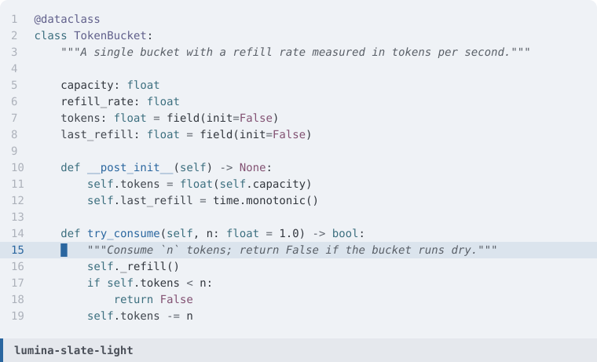

**Nocturne**

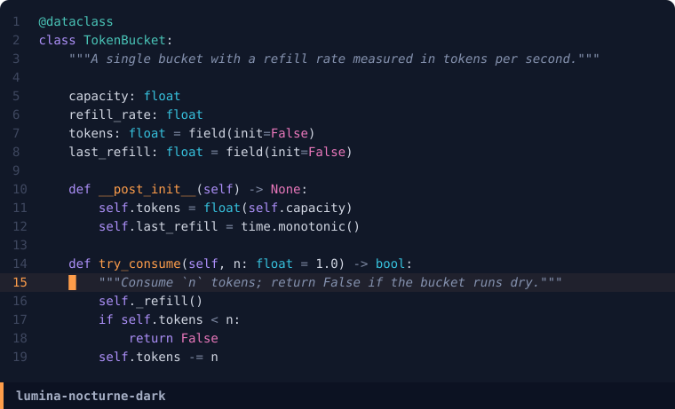 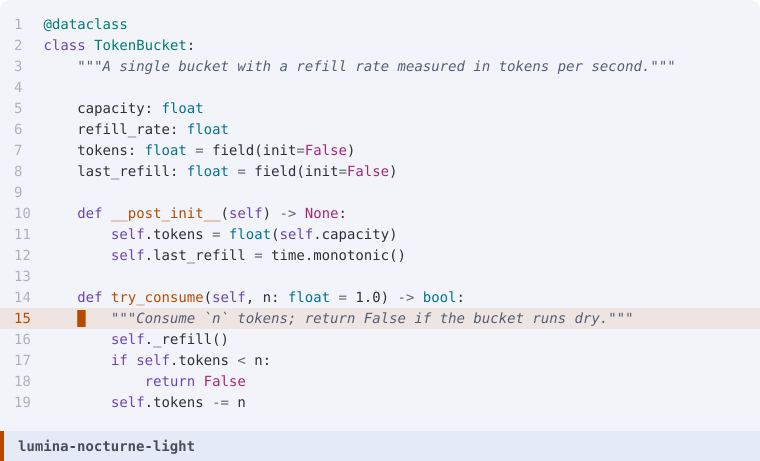

**Amethyst**

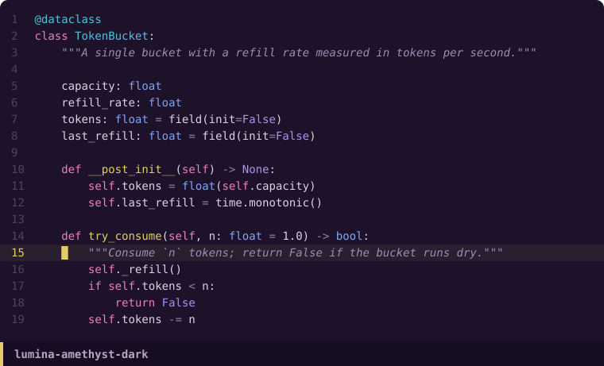 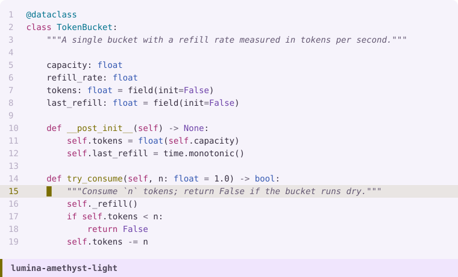

**Obsidian**

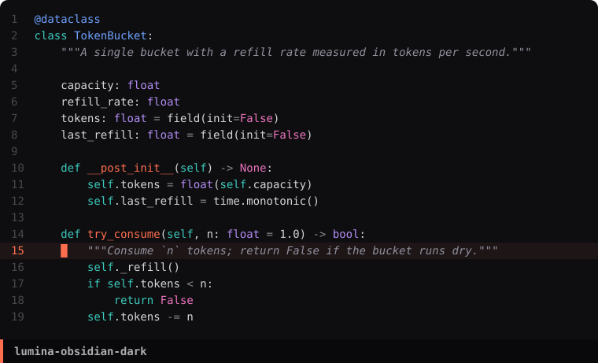 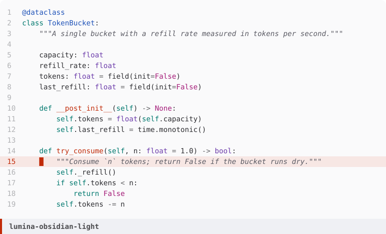

**Dawn**

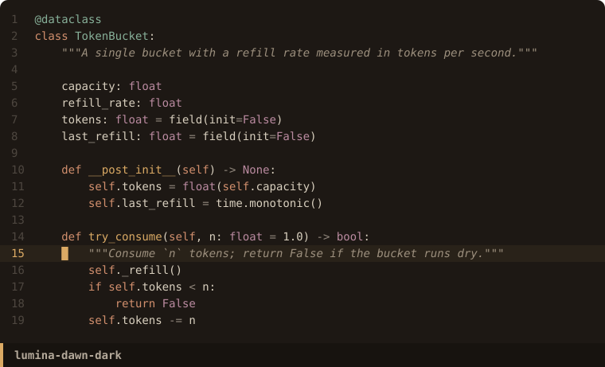 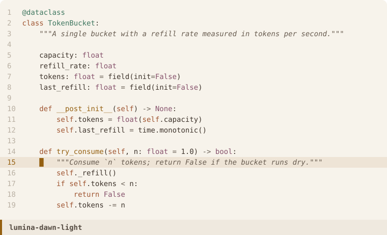

**Prisma, light ink** (black and white)

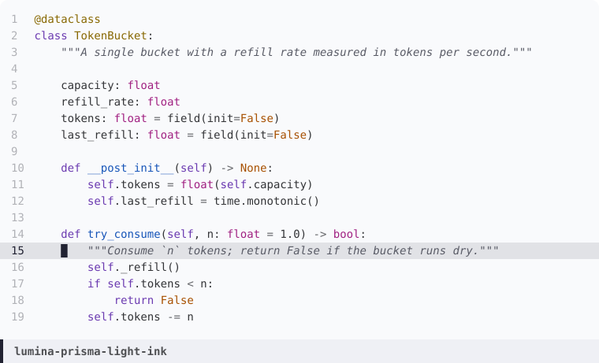

### Names

`lumina-<flavor>-<dark|light>` and `lumina-<flavor>-<dark|light>-contrast`,
for example `lumina-nocturne-dark` or `lumina-dawn-light-contrast`.
Prisma adds `lumina-prisma-light-ink` and `lumina-prisma-light-ink-contrast`.

## Supported targets

| Target | Output |
|---|---|
| **Emacs** (vanilla `deftheme`)  | `emacs/themes/*.el` (38) |
| **Neovim** (Lua colorscheme)    | `nvim/colors/*.lua` (38) |
| **VS Code** (extension)         | `vscode/themes/*.json` (38) + `package.json` |
| **WezTerm** (color scheme)      | `wezterm/*.toml` (38) |
| **base24** (tinted-theming)     | `base24/*.yaml` (38) |

The Emacs files require no external dependency and load on a bare
`emacs -Q`. They style the core UI, syntax, org, magit, diff, smerge,
ediff, dired, vertico, consult, marginalia, corfu, eglot, flycheck,
flymake, which-key, treemacs, and Doom's modeline and dashboard; faces
of packages you do not use are simply ignored.

## Install

### Emacs

Requires Emacs 26.1 or later.

**MELPA**:
```elisp
M-x package-install RET lumina-themes RET
M-x load-theme RET lumina-dawn-dark RET
```

**Doom** — `packages.el`:
```elisp
(package! lumina-themes :recipe (:host github :repo "RazikSF/lumina-themes"
                                 :files ("emacs/*.el" "emacs/themes/*.el")))
```
Then `config.el`:
```elisp
(require 'lumina-themes)
(setq doom-theme 'lumina-dawn-dark)
```

**`straight.el`**:
```elisp
(straight-use-package
 '(lumina-themes :type git :host github :repo "RazikSF/lumina-themes"
                 :files ("emacs/*.el" "emacs/themes/*.el")))
(load-theme 'lumina-dawn-dark t)
```

**`elpaca`**:
```elisp
(elpaca (lumina-themes :host github :repo "RazikSF/lumina-themes"
                       :files ("emacs/*.el" "emacs/themes/*.el")))
```

**Manual**: clone the repository and add `emacs/themes/` to
`custom-theme-load-path`:
```elisp
(add-to-list 'custom-theme-load-path "/path/to/lumina-themes/emacs/themes")
(load-theme 'lumina-dawn-dark t)
```

#### Customisation

Six optional variables, set them before loading a theme or call
`M-x lumina-themes-reapply` after toggling them:

```elisp
(setq lumina-themes-brighter-comments  nil)  ; bolder comments
(setq lumina-themes-comment-bg         nil)  ; tinted comment background
(setq lumina-themes-padded-modeline    nil)  ; t, or integer pixel width
(setq lumina-themes-italic-comments    t)    ; italic on comments
(setq lumina-themes-italic-types       nil)  ; italic on type names
(setq lumina-themes-bold-keywords      nil)  ; bold on keywords
```

`M-x lumina-themes-load-random` loads a random Lumina theme.  Prefix
arg `C-u` restricts to dark, `C-u C-u` to light.

### Neovim

**`lazy.nvim`**:
```lua
{
  "RazikSF/lumina-themes",
  init = function()
    vim.opt.rtp:append(vim.fn.stdpath("data") .. "/lazy/lumina-themes/nvim")
  end,
  config = function() vim.cmd.colorscheme("lumina-dawn-dark") end,
}
```

**`packer.nvim`**:
```lua
use { "RazikSF/lumina-themes", rtp = "nvim" }
```

**`vim-plug`**:
```vim
Plug 'RazikSF/lumina-themes', { 'rtp': 'nvim' }
```

**Manual**: copy `nvim/colors/*.lua` into your Neovim runtime's
`colors/` directory, then `:colorscheme lumina-dawn-dark`.

### VS Code

**Marketplace**:
```
ext install RazikSF.lumina-themes
```
Then `Cmd/Ctrl-K Cmd/Ctrl-T` and pick a Lumina flavor.

**Manual `.vsix`**:
```sh
cd vscode && npx @vscode/vsce package
code --install-extension lumina-themes-1.0.0.vsix
```

### WezTerm

```lua
config.color_scheme_dirs = { "/path/to/lumina-themes/wezterm" }
config.color_scheme = "lumina-dawn-dark"
```

### base24 / tinted-theming

The `base24/` YAML files are standard tinted-theming schemes. Use them
with [tinty](https://github.com/tinted-theming/tinty),
[base16-shell](https://github.com/tinted-theming/base16-shell) or any
community template to theme terminals, `bat`, `fzf`, `btop` and the rest
of the CLI from a single source.

## Architecture

```
generators/v2_palettes.py   OKLCH palettes; derives signature and -contrast
spec/lumina.json            generated palettes (one per flavor/variant)
spec/faces.json             declarative face mapping (~390 faces)
spec/faces_v2.json          Lumina 2 overlay (lamp, halo, diffs, headings)
spec/nvim_highlights.json   declarative Neovim highlight mapping
spec/vscode.json            declarative VS Code workbench + tokens
generators/lumina_gen.py    spec -> all targets; embeds per-flavor schemas
emacs/themes/*.el           generated; pure vanilla deftheme
emacs/lumina-themes.el      Emacs package loader
nvim/colors/*.lua           generated
vscode/themes/*.json        generated
vscode/package.json         generated; bundles all flavors
wezterm/*.toml              generated
base24/*.yaml               generated
tools/preview/              Emacs batch renderer, comparison pages, gallery
tools/distance.py           perceptual distance between flavors
archive/                    fifteen retired flavors, restorable
Makefile                    make build / make check / make verify
```

Lumina is palette-first. `spec/lumina.json` carries one palette per
(flavor, mode); per-flavor syntax schemas live in
`generators/lumina_gen.py` as Python data (lead accent, rainbow /
outline / orderless sequences, modeline and vertico backgrounds, magit
and org mappings, preprocessor and escape slots — shared between dark
and light). The generator resolves palette references to literal hex
per flavor and emits one file per target per (flavor, mode).

A color edit in `spec/lumina.json` propagates to all five targets on
the next `make build`.

## Develop

Requires Python 3.11+.

```sh
make build       # spec -> all targets
python3 generators/v2_palettes.py   # OKLCH -> spec/lumina.json
make check       # contrast and lightness gate
make verify      # rebuild, check, and smoke-test every theme on vanilla Emacs
tools/preview/gallery.sh            # re-render assets/screens/*.svg
make extract     # one-time bootstrap from existing .el files (rarely needed)
```

## Contributing

Issues for color bugs — contrast on a specific UI surface, a face that
lands wrong, a missing package — are welcome.

Pull requests that add a flavor must justify its position on the hue
coverage map (does it fill a real gap, with a specific real-world
referent?), follow the single-lead discipline, and include a
screenshot.

Pull requests that retune existing colors should explain the intent and
include before/after captures.

## License

Licensed under the [MIT License](LICENSE).
